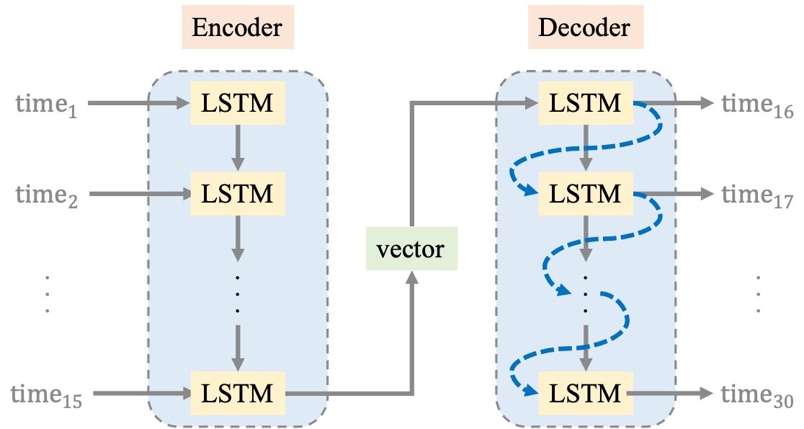

# Electricity-Forecasting

#### [DSAI_HW1-Electricity_Forecasting](https://docs.google.com/document/d/11G_SqvtPEQD4cqCEfBCpBS4L8BeiVIwlNoXYy7oSdKM/edit)
---
## Method 1: regression analysis

### Data analysis
* 將 2020/01/01 至 2022/02/28 的資料以 8:2 的比例切分為訓練集與測試集
* 共計有 790 天，所以取前 632 天作為訓練集、最後 158 天為測試集

### Data pre-processing
* 將 2020/01/01 至 2022/02/28 期間的「備轉容量」取出
* 將第 1 天到第 632 天的「備轉容量」作為訓練集（2020/01/01 - 2021/09/23）
* 將第 633 天到第 790 天的「備轉容量」作為測試集（2021/09/24 - 2022/02/28）

### Model training
* 計算訓練集的 N 次迴歸線，並與測試集計算 Root-Mean-Squared-Error (RMSE)
* 取出使得 RMSE 最小的 N 值以及其方程式
* |    poly    |               RMSE|
  |:----------:|------------------:|
  |      1     |                521|
  |      2     |                652|
  |      3     |               2348|
  |      4     |               2227|
  |      5     |               3446|
  |      6     |               6806|
  |      7     |               2082|
  |      8     |              18015|
  |      9     |              13739|
  |      10    |             108707|
  |      11    |             481631|
  |      12    |             566084|
  |      13    |             346448|
  |      14    |            1033156|
  |      15    |            7172321|

### Model testing
* 藉由方程式計算出要預測的備轉容量
```
result: 0.266 x + 3608

  date       x     operating_reserve(MW)
20220330    820           3826
20220331    821           3826
20220401    822           3827
20220402    823           3827
20220403    824           3827
20220404    825           3827
20220405    826           3828
20220406    827           3828
20220407    828           3828
20220408    829           3829
20220409    830           3829
20220410    831           3829
20220411    832           3829
20220412    833           3830
20220413    834           3830
```


## Method 2: Sequence-to-Sequence (Seq2Seq)


### Framework


### Data analysis 1: 台灣電力公司_過去電力供需資訊
* 資料： [台灣電力公司_過去電力供需資訊_1.csv](https://github.com/Aquarium1222/Electricity-Forecasting/blob/main/data/%E5%8F%B0%E7%81%A3%E9%9B%BB%E5%8A%9B%E5%85%AC%E5%8F%B8_%E9%81%8E%E5%8E%BB%E9%9B%BB%E5%8A%9B%E4%BE%9B%E9%9C%80%E8%B3%87%E8%A8%8A_1.csv) 與 [台灣電力公司_過去電力供需資訊_2.csv](https://github.com/Aquarium1222/Electricity-Forecasting/blob/main/data/%E5%8F%B0%E7%81%A3%E9%9B%BB%E5%8A%9B%E5%85%AC%E5%8F%B8_%E9%81%8E%E5%8E%BB%E9%9B%BB%E5%8A%9B%E4%BE%9B%E9%9C%80%E8%B3%87%E8%A8%8A_2.csv) ，共兩份 csv 檔案
  * 包含 2020/01/01 - 2022/02/28，共 790 天之資料
  * 每筆資料包含下表 70 種資訊
  * |     |         1          |      2       |      3       |       4       |        5         |        6         |      7       |
    |:---:|:------------------:|:------------:|:------------:|:-------------:|:----------------:|:----------------:|:------------:|
    |  1  | 淨尖峰供電能力(MW) | 尖峰負載(MW) | 備轉容量(MW) | 備轉容量率(%) | 工業用電(百萬度) | 民生用電(百萬度) | 核一#1(萬瓩) |
    |  2  |    核一#2(萬瓩)    | 核二#1(萬瓩) | 核二#2(萬瓩) |    核三#1     |      核三#2      |      林口#1      |    林口#2    |
    |  3  |       林口#3       |    台中#1    |    台中#2    |    台中#3     |      台中#4      |      台中#5      |    台中#6    |
    |  4  |       台中#7       |    台中#8    |    台中#9    |    台中#10    |      興達#1      |      興達#2      |    興達#3    |
    |  5  |       興達#4       |    大林#1    |    大林#2    |    和平#1     |      和平#2      |      麥寮#1      |    麥寮#2    |
    |  6  |       麥寮#3       |   汽電共生   | 大潭 (#1-#6) | 通霄 (#1-#6)  |   興達 (#1-#5)   |   南部 (#1-#4)   | 大林(#5-#6)  |
    |  7  |    海湖 (#1-#2)    |   國光 #1    |    新桃#1    |    星彰#1     |      星元#1      |      嘉惠#1      | 豐德(#1-#2)  |
    |  8  |    協和 (#1-#4)    |    氣渦輪    |     離島     |     德基      |       青山       |       谷關       |     天輪     |
    |  9  |        馬鞍        |     萬大     |     大觀     |     鉅工      |      大觀二      |       明潭       |     碧海     |
    | 10  |        立霧        |     龍澗     |     卓蘭     |     水里      |    其他小水力    |     風力發電     |  太陽能發電  |

* 方法：使用 Seq2Seq 方法發現預測的目標（備轉容量）與其他 69 種屬性並無明顯相關


### Data analysis 2: 台灣電力公司_過去電力供需資訊

* 資料： [每日尖峰備轉容量率_1.csv](https://github.com/Aquarium1222/Electricity-Forecasting/blob/main/data/%E6%AF%8F%E6%97%A5%E5%B0%96%E5%B3%B0%E5%82%99%E8%BD%89%E5%AE%B9%E9%87%8F%E7%8E%87_1.csv) 與 [每日尖峰備轉容量率_2.csv](https://github.com/Aquarium1222/Electricity-Forecasting/blob/main/data/%E6%AF%8F%E6%97%A5%E5%B0%96%E5%B3%B0%E5%82%99%E8%BD%89%E5%AE%B9%E9%87%8F%E7%8E%87_2.csv) ，共兩份 csv 檔案
  * 包含 2019/01/01 - 2022/03/29，共 1180 天之資料
  * 每筆資料包含下列 2 種資訊
    *  備轉容量(萬瓩)
    *  備轉容量率(%)

* 方法：使用 Seq2Seq 方法發現預測的目標（備轉容量）與備轉容量率並無明顯相關

### Data analysis 3: 局屬氣象站-現在天氣觀測報告、空氣品質指標
* 由於備轉容量之最小單位為一天、且不分縣市，與天氣及空氣品質之時空間單位不同，因此不採用

### Data pre-processing
* 依據上述 Data analysis 的結果，得知只需使用歷史備轉容量來預測未來備轉容量即可

### Feature selection


### Model training

